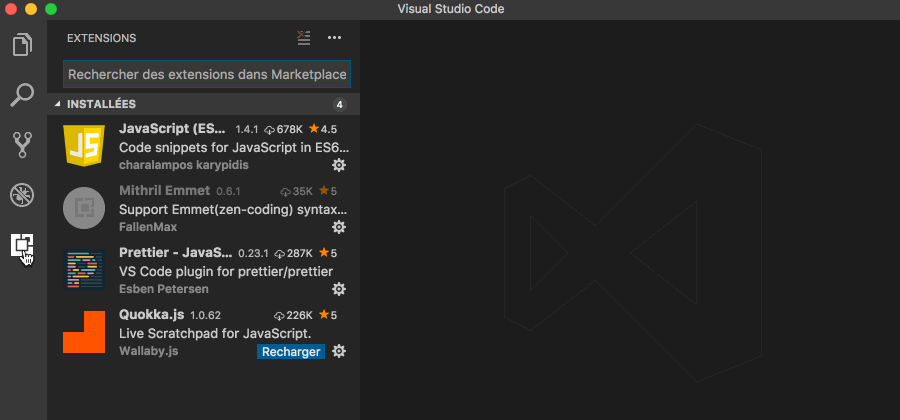

# Ressources

- [Espace Moodle](http://moodle.unil.ch/course/view.php?id=8995)
- [Liste d'exercices]( https://gist.github.com/GregoryThonney)
- Lien vers cette page : http://bit.ly/matieres_pi1
- [Procédure d'installation des plugins](##Procédure)

***

# Contenu des séances

## Séance 1

[Série 1](https://gist.github.com/GregoryThonney/7639c4f1e2c211dd0af9500f93b41be2)

### Notions HTML

- élément
- attribut
- structure minimale

### Balises HTML

- html, head, body
- p, div, span
- ul, ol, li
- h1, h2, h3, h4, h5, h6
- a (href), img (src), input (text, password, checkbox, button)
- br, hr

### Notions outils

- indentation
- coloration syntaxique
- complétion syntaxique

### Outils

- Github (création d'un compte)
- Codepen (création d'un compte)
- Visual studio (installation)
- Emmet

***

## Séance 2

[Série 2](https://gist.github.com/GregoryThonney/b5913313481bdda5a0f2aba4e4e46d64)

### Notions HTML

- commentaires
- attribut Data
- sensibilité à la casse
- attributs id, class
- balise style (CSS interne)
- balise link (CSS externe)

### Notions CSS

- sélecteurs, propriétés, valeurs
- pseudo-classes

### Sélecteurs CSS

- .nomClasse, #nomId
- :link, :visited, :hover

### Propriétés CSS

- background-color, color
- font-family, font-size
- margin, padding
- border, border-radius
- transform, transition

***

## Procédure

